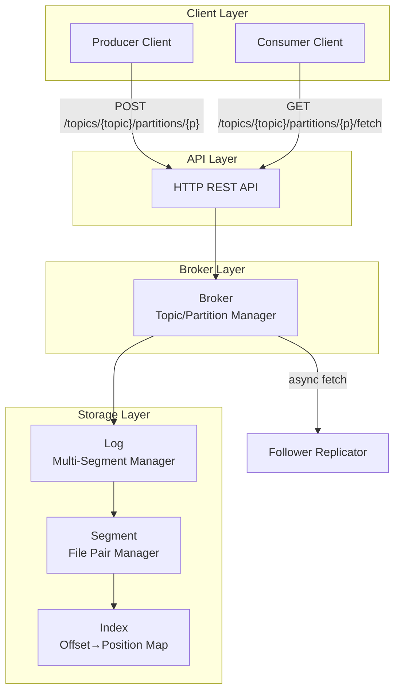
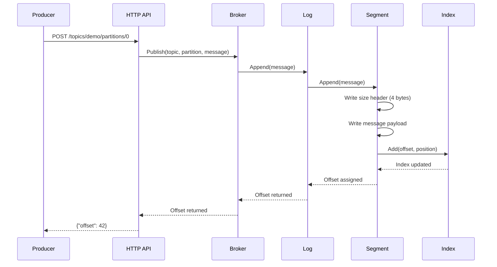
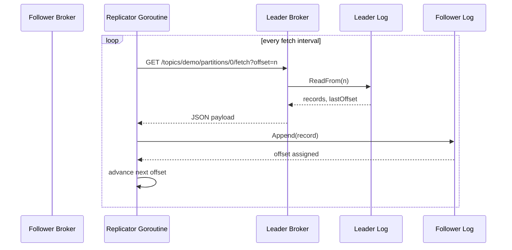
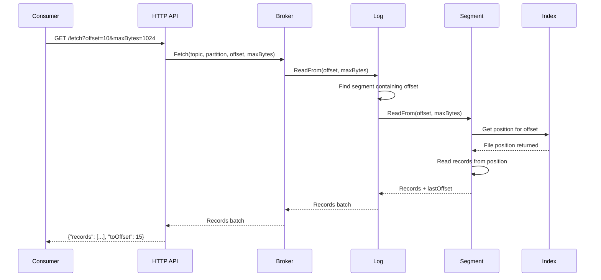
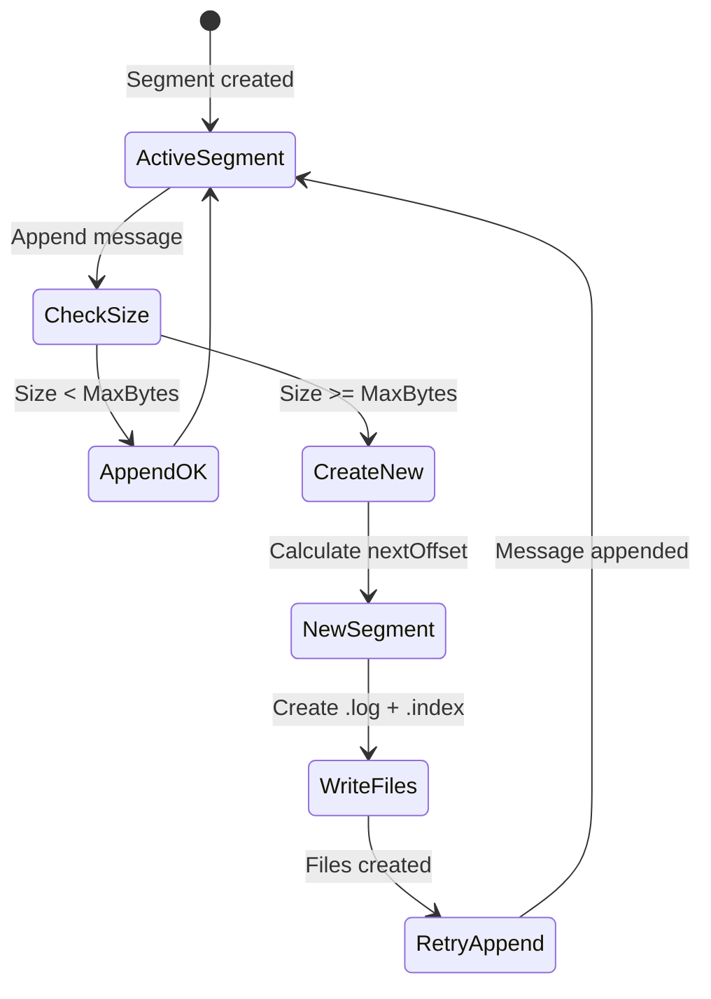
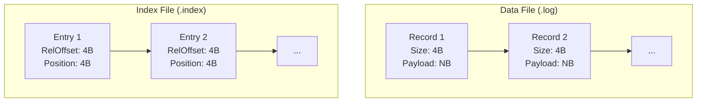
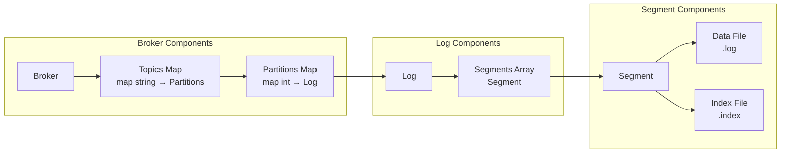

# Go Kafka From Scratch

A simplified Kafka-like message broker implementation in Go, demonstrating core distributed log concepts—append-only logs, offset-based consumption, segment-based storage—and now multiple replication styles (single-leader, multi-leader fan-out and leaderless quorums with hinted handoff/read-repair).

## Architecture Overview

This implementation follows a **layered architecture** with clear separation of concerns:



## Core Modules

### 1. Broker (`internal/broker/`)
Manages multiple topics and partitions, routing requests to appropriate logs and coordinating replication when cluster metadata is configured.

**Key Operations:**
- `EnsurePartition()` - Create/ensure partition exists
- `Publish()` - Append messages to partition
- `Fetch()` - Read messages from offset
- `Topics()` - List available topics
- `PartitionLeader()` - Discover the leader for a topic-partition

### 2. LogStore (`internal/logstore/`)
Storage engine with three components:

- **Log** (`log.go`) - Manages segment sequence, handles rotation
- **Segment** (`segment.go`) - Fixed-size file pair (.log + .index)
- **Index** (`index.go`) - Maps offsets to file positions

### 3. API Layer (`internal/api/`)
HTTP REST API exposing broker operations and enforcing consistency hints (for example, `X-Read-Min-Offset` to divert lagging followers).

```
POST   /topics/{topic}/partitions/{p}           ? Publish message
GET    /topics/{topic}/partitions/{p}/fetch     ? Fetch messages (?minOffset= / X-Read-Min-Offset supported)
GET    /cluster/topics/{topic}/partitions/{p}   ? Cluster metadata (leader, epoch, replicas)
POST   /cluster/topics/{topic}/partitions/{p}/leader
                                                ? Leader failover announcement (epoch fencing)
POST   /cluster/topics/{topic}/partitions/{p}/replica
                                                ? Leaderless replica ingest (fan-out, hinted handoff, read repair)
```

### 4. Client Libraries (`pkg/client/`)
High-level APIs for producers and consumers, plus session helpers that remember per-topic offsets to deliver read-your-writes and monotonic reads across replicas.

### 5. Replication (`internal/broker/replication.go`, `internal/broker/leaderless.go`)
Follower brokers stay up to date through a pull-based worker that streams batches from the current leader via HTTP and appends locally. `ClusterConfig` exposes `ReplicaFetchInterval`, `ReplicaRetryInterval` and `FailoverTimeout` to tune replication cadence, retry backoff and the heartbeat window that must elapse before triggering an automatic leader promotion.

For Dynamo/Cassandra-style deployments you can opt into `ReplicationModeLeaderless`. In that mode the broker that receives a client request fans the write out to each replica in parallel, waits for a configurable quorum (`LeaderlessWriteQuorum`, default **2**) and records hints for any failed replicas so it can replay them later. Reads follow the same playbook: the coordinator issues fetches to multiple replicas (`LeaderlessReadQuorum`, default **2**), merges the superset, performs local read-repair by appending missing entries to its own log, then asynchronously repairs any lagging peers (or hands off hints if they are unreachable). A background goroutine drains the hinted handoff queue at `HintDeliveryInterval`.

## Data Flow Diagrams

### Message Publishing Flow (Leader)



### Replication Flow (Follower)



### Leader Failover & Replica Recovery

- **Heartbeat via replication fetches** – followers talk to the leader every `ReplicaFetchInterval`. Consecutive fetch failures beyond the configurable `FailoverTimeout` are treated as a missing heartbeat.
- **Priority-based promotion** – the replica ordering in `ClusterConfig.Partitions` acts as the failover policy. When a leader disappears, the next broker in that list promotes itself, increments the leader epoch, and starts accepting writes.
- **Leader epochs & fencing** – promotions bump an epoch counter that is broadcast via `POST /cluster/topics/{topic}/partitions/{p}/leader`. Any broker that restarts fetches the metadata via `GET /cluster/topics/{topic}/partitions/{p}` and refuses writes if its epoch is stale, preventing dual leaders.
- **Automatic catch-up** – `EnsurePartition` now refreshes metadata before spinning followers. When a broker rejoins, it immediately knows the current leader and starts replicating from the last local offset until it reaches the leader’s `EndOffset`.
- **Best-effort announcements** – leader changes are pushed to peers, but lagging brokers can still reconcile by explicitly fetching metadata, so clusters remain consistent even if multiple nodes restart simultaneously.

#### Cluster configuration snippet

```go
cluster := &broker.ClusterConfig{
    BrokerID: 2,
    Peers: map[int]string{
        1: "http://leader:8080",
        2: "http://follower-a:8081",
        3: "http://follower-b:8082",
    },
    Partitions: map[string]map[int]broker.PartitionAssignment{
        "demo": {
            0: {
                Leader:   1,
                Replicas: []int{1, 2, 3}, // priority order for failover
            },
        },
    },
    ReplicaFetchInterval: 100 * time.Millisecond,
    ReplicaRetryInterval: 500 * time.Millisecond,
    FailoverTimeout:      2 * time.Second,
}
```

Each broker loads the same `ClusterConfig`, changing only `BrokerID` and its `DATA_DIR`. The follower replicators use the fetch/retry intervals to control copy cadence, while `FailoverTimeout` defines how long a leader can remain silent before the next replica assumes control.

#### Manual failover walkthrough

1. Start broker **1** (leader) and broker **2** (follower) with the configuration above.
2. Publish a few records to broker **1** (`POST /topics/demo/partitions/0`).
3. Stop broker **1** or block its network port. Broker **2** notices the missing heartbeat after `FailoverTimeout` and logs a promotion message (`promoted to leader... epoch=N`).
4. Publish more records through broker **2**. Clients previously pointing at broker **1** will receive HTTP 307 responses directing them to the new leader.
5. Restart broker **1**. On boot it calls `GET /cluster/topics/demo/partitions/0`, notices it has a stale epoch, flips into follower mode, and catches up by replaying the leader’s log through the replication loop.
6. (Optional) Bring broker **2** down again to confirm broker **1** promotes itself back once it becomes the highest-priority replica.

### Message Consumption Flow



### Segment Rotation Flow



## Storage Architecture

### Directory Structure

```
{DATA_DIR}/
└── topic={topic}-part={partition}/
    ├── 00000000000000000000.log     # Segment data file
    ├── 00000000000000000000.index   # Segment index file
    ├── 00000000000000000100.log     # Next segment
    ├── 00000000000000000100.index
    └── ...
```

### File Formats



**Data File:** Append-only sequence of records (4-byte size + payload)
**Index File:** Offset-to-position mappings (8 bytes per entry)

## Component Interactions



## Running the Broker

### Configuration (Environment Variables)

```bash
DATA_DIR=./data    # Storage directory
TOPIC=demo         # Initial topic to create
ADDR=:8080         # HTTP listen address
```

### Start Server

```bash
# Using Go
go run cmd/broker/main.go

# Using Docker
docker build -t kafka-broker .
docker run -p 8080:8080 -v $(pwd)/data:/data kafka-broker
```

## Usage Examples

### Publishing Messages

```bash
# Publish a message
curl -X POST http://localhost:8080/topics/demo/partitions/0 \
     -H "Content-Type: application/octet-stream" \
     -d "Hello Kafka"

# Response: {"offset": 0}
```

### Consuming Messages

```bash
# Fetch messages from offset
curl "http://localhost:8080/topics/demo/partitions/0/fetch?offset=0&maxBytes=1024"

# Response: {"fromOffset": 0, "toOffset": 1, "records": ["SGVsbG8gS2Fma2E="]}
```

### Using Client Libraries

```go
import "github.com/yourusername/go-kafka-from-scratch/pkg/client"

// Producer
producer := client.Producer{BaseURL: "http://localhost:8080"}
offset, err := producer.Publish("demo", 0, []byte("Hello"))

// Consumer
consumer := client.Consumer{BaseURL: "http://localhost:8080"}
records, lastOffset, err := consumer.Fetch("demo", 0, 0, 1024)
```

### Consistency-Aware Sessions

```go
session, err := client.NewSession(client.SessionConfig{
    SessionID:    "user-123",                     // stick reads to the same follower
    LeaderURL:    "http://leader:8080",           // leader handles writes and lag-free reads
    FollowerURLs: []string{"http://follower:8081"},
})
if err != nil {
    log.Fatal(err)
}

off, _ := session.Publish("demo", 0, []byte("hello"))
records, last, _ := session.Fetch("demo", 0, off, 0) // guaranteed to see the write
```

The session automatically adds `minOffset`/`X-Read-Min-Offset` when reading from followers and falls back to the leader if a replica is behind, ensuring read-your-writes and monotonic reads.


### Running a Follower Replica (Programmatic Example)

Replication is activated when the broker is supplied with cluster metadata describing leaders, peers and replica sets. While the CLI entry point (`cmd/broker/main.go`) runs a standalone node, you can wire followers programmatically:

```go
cluster := &broker.ClusterConfig{
    BrokerID: 2, // this broker id
    Peers: map[int]string{
        1: "http://localhost:8080", // leader base URL
    },
    Partitions: map[string]map[int]broker.PartitionAssignment{
        "demo": {
            0: {Leader: 1, Replicas: []int{1, 2}},
        },
    },
}
follower := broker.NewBroker(broker.Config{Cluster: cluster})
follower.SetHTTPClient(&http.Client{Timeout: time.Second}) // optional custom client
_ = follower.EnsurePartition("demo", 0, "./data/topic=demo-part=0", 128<<20)
```

Once configured, the follower will continuously poll the leader’s fetch endpoint and mirror the log locally. Writes issued to a follower via the HTTP API are rejected with a redirect to the leader.

### Multi-Leader Mode

For geo-distributed or occasionally disconnected deployments you can switch a partition into multi-leader replication by setting `ReplicationMode: broker.ReplicationModeMulti`. In this mode every replica listed in the assignment is treated as a writable leader. Each broker streams raw log entries from every other replica, deduplicating them by origin/sequence metadata so that events are applied exactly once even if they travel through intermediate peers.

```go
cluster := &broker.ClusterConfig{
    BrokerID:        1,
    Peers: map[int]string{
        1: "http://dc1:8080",
        2: "http://dc2:8080",
    },
    Partitions: map[string]map[int]broker.PartitionAssignment{
        "demo": {
            0: {Leader: 1, Replicas: []int{1, 2}},
        },
    },
    ReplicationMode:      broker.ReplicationModeMulti,
    ReplicaFetchInterval: 100 * time.Millisecond,
}
node := broker.NewBroker(broker.Config{Cluster: cluster})
_ = node.EnsurePartition("demo", 0, "./data/topic=demo-part=0", 128<<20)
```

Clients can now publish to either replica and the background peer replicators will exchange updates bidirectionally. Because every node keeps its own offset space, ordering may diverge slightly between replicas; consumers should stick to a single broker per partition if they require monotonic reads.

### Leaderless Quorum Mode

Leaderless replication trades strict ordering for higher availability by letting any replica coordinate writes. Set `ReplicationMode: broker.ReplicationModeLeaderless` and provide a replica set (recommended `N=3`). When a broker receives a `POST /topics/{topic}/partitions/{p}` it:

1. Appends locally (assigning its origin/sequence metadata).
2. Issues parallel `POST /cluster/topics/{topic}/partitions/{p}/replica` calls to the remaining replicas, awaiting at least `LeaderlessWriteQuorum` acknowledgements (`W`) before replying to the client.
3. Stores hinted-handoff entries for replicas that timed out or were offline so they can be replayed once connectivity returns.

A read uses the same fan-out pattern with `LeaderlessReadQuorum` (`R`). The coordinator asks each replica for `raw=1` fetches, merges the superset (deduplicating by origin id/sequence), appends any missing entries to itself, and asynchronously repairs lagging peers (or just drops more hints). Configure `R + W > N` (the default 2/2/3 satisfies this) to guarantee that reads intersect the quorum that accepted the most recent successful write.

```go
cluster := &broker.ClusterConfig{
    BrokerID:              1,
    ReplicationMode:       broker.ReplicationModeLeaderless,
    LeaderlessWriteQuorum: 2,
    LeaderlessReadQuorum:  2,
    Peers: map[int]string{
        1: "http://broker1:8080",
        2: "http://broker2:8080",
        3: "http://broker3:8080",
    },
    Partitions: map[string]map[int]broker.PartitionAssignment{
        "demo": {
            0: {Replicas: []int{1, 2, 3}},
        },
    },
}
node := broker.NewBroker(broker.Config{Cluster: cluster})
_ = node.EnsurePartition("demo", 0, "./data/topic=demo-part=0", 128<<20)
```

Because every replica can coordinate both reads and writes, clients can hit whichever broker is reachable without first discovering a leader. Quorum failures surface as HTTP 503 so callers can retry or downgrade their consistency level if desired.

## Design Decisions

### Strengths
- Simple, understandable codebase
- Clean separation of concerns
- Excellent testability (100% test coverage)
- Segment-based storage (scalable)
- Asynchronous single-leader replication plus optional multi-leader and leaderless quorum modes
- Hinted handoff and read-repair close the eventual-consistency gap automatically
- Optional client sessions offer read-your-writes and monotonic reads
- Standard Go project layout

### Limitations
- Static cluster assignments (no controller or dynamic rebalancing)
- Leader election relies on static replica priority (no quorum/majority safety)
- Client-managed consistency (sessions must steer reads to suitable replicas and choose quorum knobs)
- No consumer groups or offset commits
- No retention policies or compaction
- No authentication/authorization

## Project Structure

```
go-kafka-from-scratch/
├── cmd/broker/          # Application entry point
├── internal/            # Internal packages
│   ├── api/             # HTTP REST endpoints
│   ├── broker/          # Topic/partition management
│   ├── logstore/        # Storage engine (log/segment/index)
│   └── types/           # Shared data structures
├── pkg/client/          # Public client libraries
└── test/                # Integration tests
```

## Testing

```bash
# Run all tests
go test ./...

# Run with coverage
go test -cover ./...

# Integration tests
go test ./test/...
```

## Development

```bash
# Build
make build

# Run tests
make test

# Docker build
make docker-build
```

## Key Concepts Demonstrated

1. **Append-Only Logs** - Messages are never modified, only appended
2. **Offset-Based Consumption** - Each message has a sequential offset
3. **Segment-Based Storage** - Logs split into fixed-size segments for efficiency
4. **Index Files** - Enable O(1) offset-to-position lookups
5. **Concurrent Access Control** - Read-write mutexes for thread safety

## Use Cases

- Educational purposes (learning Kafka internals)
- Single-node message queue
- Development/testing environments
- Prototype/proof-of-concept systems

## License

See LICENSE file for details.
